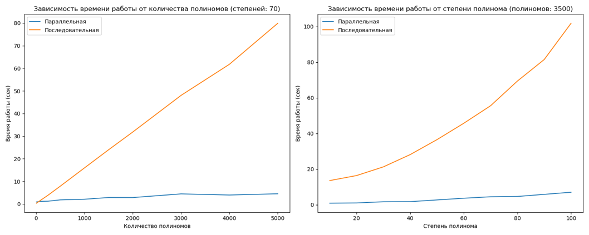

# Вычисление общего делителя полиномов над F2^m при помощи расширенного алгоритма Евклида

## Описание проекта

Проект представляет собой реализацию расширенного алгоритма Евклида для вычисления общего делителя (НОД) двух и более полиномов над F2^m. Реализованы последовательный алгоритм на CPU и параллельный алгоритм на GPU.

## Структура проекта

```
/project
│
├── /data
│   ├── degrees.txt
│   ├── amount.txt
│   └── polynomials.txt
│
├── /results
│
├── common.py
├── gcd_algorithms_performance.py
├── implementation_for_cuda_parallel.py
├── implementation_for_sequential.py
├── PolynomialOperations.py
├── polynomials_generation.py
└── run.py
```

### Описание файлов

- **data**: Директория для хранения данных (степени, количество и сами полиномы).
- **results**: Директория, в которой сохраняются результаты выполнения алгоритма.
- **common.py**: Общие функции и настройки для алгоритмов.
- **gcd_algorithms_performance.py**: Оценка производительности алгоритмов.
- **implementation_for_cuda_parallel.py**: Параллельная реализация на GPU с использованием библиотеки Numba.
- **implementation_for_sequential.py**: Последовательная реализация на CPU.
- **PolynomialOperations.py**: Операции над полиномами.
- **polynomials_generation.py**: Генерация наборов полиномов в поле F2^m.
- **run.py**: Скрипт для запуска алгоритмов с различными параметрами.

## Результат работы

В данном разделе представлены графики производительности, отражающие время выполнения расширенного алгоритма Евклида для различных степеней и количеств полиномов. Измерения проведены с использованием последовательной и параллельной реализаций алгоритма на CPU и GPU соответственно.



*Примечание: Графики предоставляют визуальное представление времени выполнения алгоритма в зависимости от параметров (степень, количество полиномов).*
